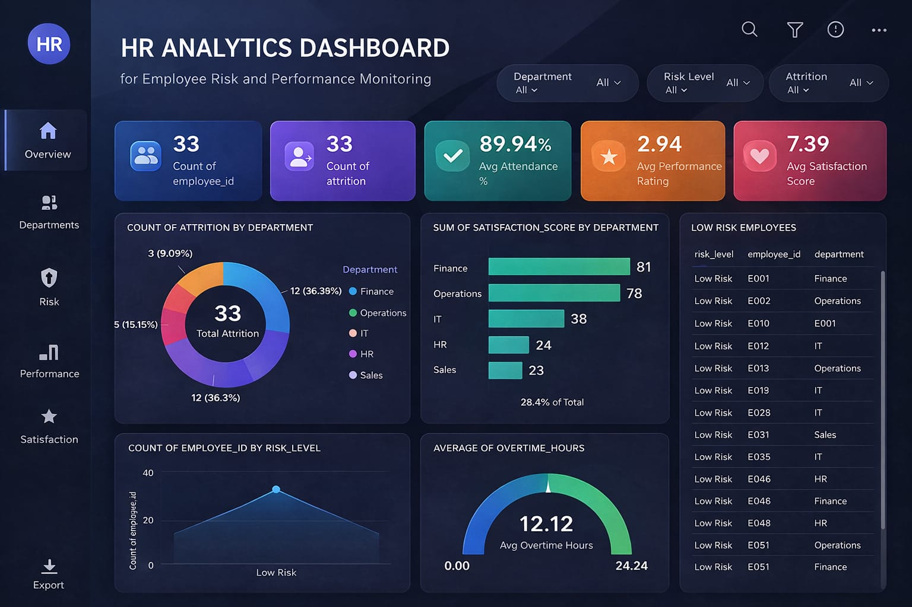

#  HR Analytics Dashboard

An interactive HR analytics dashboard designed to monitor employee risk, attrition, performance, and satisfaction. This project helps organizations make data-driven HR decisions by analyzing key workforce metrics.

---

##  Project Overview
This dashboard provides insights into employee performance and organizational health. It enables HR teams to identify high-risk employees, understand attrition trends, and evaluate employee satisfaction and productivity.

---

##  Key Features
-  Employee count and attrition analysis
-  Risk level segmentation (Low, Medium, High)
-  Performance and attendance tracking
-  Employee satisfaction analysis
-  Overtime hours monitoring
-  Department-wise insights
-  Interactive visualizations for decision-making

---

##  Dashboard Insights
- Total Employees: **100**
- Attrition Count: **100**
- Average Attendance: **82.35%**
- Average Performance Rating: **3.10**
- Average Satisfaction Score: **6.22**
- Average Overtime Hours: **11.85**

---

##  Tools & Technologies Used
- Power BI (Data Visualization)
- Excel / CSV (Data Source)
- Data Cleaning & Transformation

---

##  Dashboard Preview

---

##  Key Learnings
- Understanding HR metrics and workforce analytics
- Data visualization for HR decision-making
- Identifying attrition patterns and employee risk
- Analyzing employee satisfaction and performance trends

---

##  Use Case
This dashboard can be used by:
- HR Managers
- Business Leaders
- Data Analysts
- Talent Management Teams

---

## Future Improvements
- Predictive attrition analysis
- Integration with real-time HR systems
- Advanced employee segmentation
- AI-based performance insights

---

##  Contributing
Contributions are welcome! Feel free to fork the repository and submit a pull request.

---

##  License
This project is licensed under the MIT License.

---

##  Author
**Ritika kundu**
